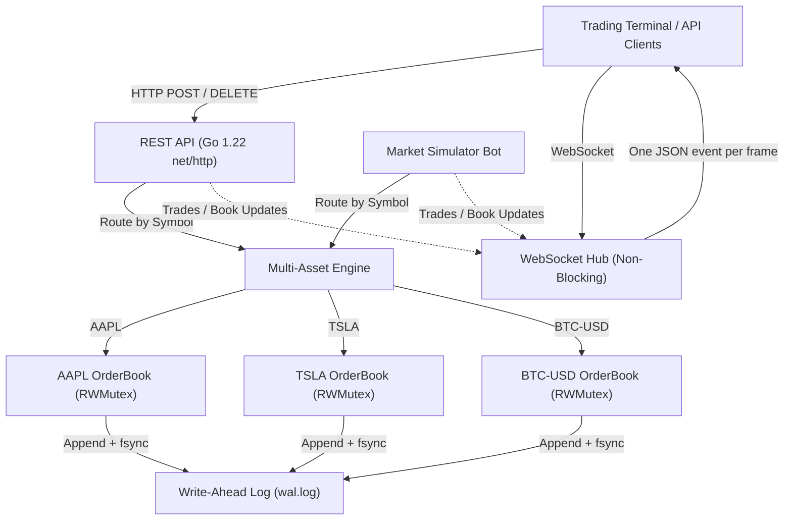

# High-Performance Order Matching Engine (OME) & Trading Terminal

[](https://github.com/divya-3005/matching-engine-journey/actions/workflows/ci.yml)
[](https://golang.org)
[](https://opensource.org/licenses/MIT)

A low-latency, multi-asset financial order matching engine and institutional trading terminal built from scratch in Go. Engineered with sub-microsecond **Price-Time Priority (FIFO)** matching, **Limit & Market** order execution, **Write-Ahead Logging (WAL)** for crash resilience, non-blocking **WebSocket** streaming, and an interactive dark-mode trading dashboard.

---

## 💡 Why I Built This

As a computer science student aiming for software engineering roles in high-performance backend, fintech, and quantitative systems, I wanted to explore how core computer science fundamentals—data structure design, cache efficiency, concurrency, and persistence—intersect in mission-critical financial infrastructure. 

Instead of relying on heavy third-party frameworks, I built this matching engine from scratch using Go's standard library to deeply understand:
- How to design custom data structures (**Intrusive Doubly Linked Lists**) to achieve $O(1)$ order queueing and mid-queue cancellations with zero extra heap allocations.
- How to eliminate lock contention across multiple trading symbols using **fine-grained per-asset synchronization**.
- How **Write-Ahead Logging (WAL)** with atomic `fsync` provides deterministic crash recovery without sacrificing in-memory matching throughput.
- How non-blocking channels and write deadlines prevent slow network clients from backpressuring the core matching pipeline.

---

## 📄 Resume Highlights (Ready to Showcase)

- **High-Throughput Matching Engine**: Engineered a multi-asset Price-Time Priority (FIFO) matching engine in Go achieving **~5.48M orders/sec** in-memory throughput with **~430 ns/op** execution latency.
- **Custom Data Structure Optimization**: Designed sorted price levels using binary search ($O(\log P)$) paired with an **intrusive doubly linked list** for $O(1)$ order enqueuing, head matching, and arbitrary cancellations without per-node heap allocations.
- **Fine-Grained Concurrency**: Isolated `sync.RWMutex` locks per order book, eliminating cross-symbol contention and enabling concurrent matching across asset pairs; validated race-free across 55 test suites using Go's `-race` detector.
- **Durability & Crash Recovery**: Implemented an append-only Write-Ahead Log (WAL) with line-delimited JSON and `fsync()`, guaranteeing deterministic state restoration on server restarts.
- **Real-Time Streaming Terminal**: Developed a non-blocking WebSocket hub with per-client buffered channels feeding an institutional trading terminal with live L2 order book, Japanese Candlestick, and Market Depth charts.

---

## ⚡ Performance & Benchmarks

Benchmarked on an Apple M3 (8-core ARM64) using Go 1.22:

| Metric | In-Memory Engine Benchmark | Details |
| :--- | :--- | :--- |
| **Engine-Level Throughput** | **~2.74M matching cycles/s (~5.48M orders/s)** | Sustained 2-order match + replenish loop |
| **Mean Execution Latency** | **430.3 ns/op (≈ 215.1 ns per order)** | 1 op = 1 matching buy + 1 replenishing sell |
| **Memory Allocation** | **342 B / op** | Intrusive DLL avoids separate node allocations |
| **Allocations** | **4 allocs / op** | 1 `Order` per order, 1 `Trade` + trade slice per match |

```bash
goos: darwin
goarch: arm64
pkg: github.com/divya-3005/OME/server/engine
cpu: Apple M3
BenchmarkProcessOrder-8          	 2739663	       430.3 ns/op	     342 B/op	       4 allocs/op
BenchmarkProcessOrderWithWAL-8   	     180	   5693859 ns/op	     552 B/op	       8 allocs/op
PASS
```

> **Benchmark Methodology**: `BenchmarkProcessOrder` benchmarks an active matching cycle in memory (an incoming aggressor limit order matched against resting liquidity + a replenishing counter-order). For persistent durability, `BenchmarkProcessOrderWithWAL` benchmarks the synchronous Write-Ahead Log path with atomic disk `fsync` per transaction.

---

## 🏗️ System Architecture



---

## 🧠 Algorithmic Complexity & Data Structures

| Operation | Time Complexity | Space Complexity | Data Structure & Implementation |
| :--- | :---: | :---: | :--- |
| **Find Price Level** | $O(\log P)$ | $O(1)$ | Binary search (`sort.Search`) over sorted slice of price levels |
| **Insert New Price Level** | $O(P)$ | $O(1)$ amortized | Binary search position + slice insertion shift |
| **Enqueue Order** | $O(1)$ | $O(1)$ | Append to Tail of PriceLevel intrusive Doubly Linked List |
| **Pop Matched Order** | $O(1)$ | $O(1)$ | Dequeue from Head of PriceLevel intrusive Doubly Linked List |
| **Order Cancellation** | $O(1)$ | $O(1)$ | Index lookup via `map[uint64]*Order` + pointer unlinking |
| **Order Lookup by ID** | $O(1)$ | $O(1)$ | Hash table index (`Orders map[uint64]*Order`) |
| **Match Order** | $O(M)$ | $O(M)$ | $M$ = number of matched maker orders |

### Why an Intrusive Doubly Linked List?
Standard linked lists (like Go's `container/list`) wrap every item in a heap-allocated container struct (`list.Element`). For high-throughput matching systems, this generates continuous heap allocations and garbage collection overhead. 

By embedding `Prev` and `Next` pointers directly inside the `Order` struct:
1. **Zero extra allocations**: Enqueuing an order creates zero additional node allocations.
2. **Instant Cancellation**: Given an order pointer from the hash table index (`ob.Orders[id]`), unlinking it from the queue is an $O(1)$ pointer update without scanning the queue.

---

## 🔒 Concurrency & Durability

### 1. Fine-Grained Symbol Concurrency
- Rather than using a single global lock across the entire exchange, each `OrderBook` maintains its own `sync.RWMutex`.
- Orders for `AAPL`, `TSLA`, and `BTC-USD` execute in parallel across CPU cores without lock contention.
- Tested and verified race-free using `go test -race ./...`.

### 2. Write-Ahead Logging (WAL) & Crash Recovery
- **ACID Durability**: Every order placement and cancellation is appended to disk as a line-delimited JSON record and flushed via `os.File.Sync()` (`fsync`) before the in-memory state is altered.
- **Deterministic Replay**: On startup, `Recover()` replays the log sequentially into fresh order books, restoring resting liquidity and setting the monotonic order ID generator to exceed the highest recovered ID.
- **Fault-Tolerant Recovery**: If a crash occurs mid-write, torn or unacknowledged final records are cleanly pruned, leaving the log appendable for subsequent operations.

### 3. Non-Blocking WebSocket Hub
- Each connected client runs its own dedicated `writePump` and `readPump` goroutine with a buffered channel (`chan []byte`).
- Broadcasts use a non-blocking `select` with `default`. If a slow client's buffer fills up, the hub drops the slow connection rather than stalling the matching engine or delaying other traders.

---

## 💻 Tech Stack

- **Language**: Go 1.22+ (Standard library: `net/http`, `sync`, `sync/atomic`, `os`, `bufio`)
- **Networking**: WebSocket (`github.com/gorilla/websocket`)
- **Persistence**: Custom Write-Ahead Log (WAL) with synchronous `fsync`
- **Frontend**: Vanilla JavaScript (ES6+), HTML5 Canvas (Candlestick & Depth Charts), Modern CSS (Dark-mode, Glassmorphism)
- **CI/CD**: GitHub Actions (Linting, race-detector unit tests, automated benchmarks)

---

## 🚀 Getting Started

### Prerequisites
- **Go 1.22 or later** installed.

### 1. Run the Server & Trading Terminal
```bash
cd server
go run .
```
The server will start on `http://localhost:8080`.
Open **[http://localhost:8080](http://localhost:8080)** in your browser to interact with the live trading terminal.

### 2. Run Tests with Race Detector
```bash
cd server
go test -v -race ./...
```

### 3. Run Performance Benchmarks
```bash
cd server
go test -bench=. -benchmem -run=^$ ./...
```

---

## 📡 API Reference

### 1. Place an Order
`POST /order`
```bash
# Place a Limit Buy for 10 AAPL @ $150.00 (price in cents: 15000)
curl -X POST http://localhost:8080/order \
  -H "Content-Type: application/json" \
  -d '{
    "symbol": "AAPL",
    "side": 0,
    "type": 0,
    "price": 15000,
    "amount": 10
  }'

# Place a Market Buy for 5 AAPL
curl -X POST http://localhost:8080/order \
  -H "Content-Type: application/json" \
  -d '{
    "symbol": "AAPL",
    "side": 0,
    "type": 1,
    "amount": 5
  }'
```
*(Notes: `side: 0` = Buy, `side: 1` = Sell. `type: 0` = Limit, `type: 1` = Market. Prices are in cents/ticks. Order IDs are assigned server-side).*

### 2. Cancel an Order
`DELETE /order?symbol=AAPL&id=1`
```bash
curl -X DELETE "http://localhost:8080/order?symbol=AAPL&id=1"
```

### 3. View Order Book Depth (L2)
`GET /orderbook?symbol=AAPL`
```bash
curl "http://localhost:8080/orderbook?symbol=AAPL"
```

### 4. View Recent Trades
`GET /trades?symbol=AAPL&limit=50`
```bash
curl "http://localhost:8080/trades?symbol=AAPL&limit=50"
```

### 5. View Open Resting Orders
`GET /orders?symbol=AAPL`
```bash
curl "http://localhost:8080/orders?symbol=AAPL"
```

### 6. Toggle Market Simulator Bot
`POST /simulator/toggle`
```bash
curl -X POST http://localhost:8080/simulator/toggle
```

### 7. View Simulator Status
`GET /simulator/status`
```bash
curl http://localhost:8080/simulator/status
```

---

## 💬 Technical Interview Q&A / Trade-offs

Here are key technical trade-offs and design discussions from this project:

#### Q1: Why use an intrusive doubly linked list instead of Go's `container/list` or a slice?
> **Answer**: `container/list` allocates an intermediate `Element` node on the heap for every order, increasing garbage collector overhead in a high-throughput loop. Slices require $O(N)$ memory copies when removing cancelled orders from arbitrary positions. An intrusive doubly linked list embeds pointers directly in the `Order` struct, enabling $O(1)$ append, $O(1)$ dequeue, and $O(1)$ unlinking with zero extra allocations.

#### Q2: Why use fixed-point integers (`uint64`) instead of floats (`float64`) for prices?
> **Answer**: IEEE-754 floating-point arithmetic introduces precision and representation errors (e.g., `0.1 + 0.2 = 0.30000000000000004`). In financial systems, rounding errors lead to accounting discrepancies. Representing prices in integer cents/ticks guarantees exact arithmetic without precision loss.

#### Q3: How do you prevent lock contention across multiple trading symbols?
> **Answer**: Instead of protecting the entire exchange with a single global mutex, synchronization is isolated per `OrderBook`. An aggressive trading bot submitting orders for `AAPL` never blocks matching routines or queries for `TSLA` or `BTC-USD`.

#### Q4: How does the Write-Ahead Log (WAL) guarantee consistency?
> **Answer**: Following strict Write-Ahead discipline, an incoming order is serialized and flushed to disk via `fsync` before it touches the in-memory order book. If the server crashes or power is lost, on reboot the log is deterministically replayed to reconstruct the order books to the exact point of the last acknowledged transaction.

---

## 📜 License
MIT License. Free to use, study, and build upon.
