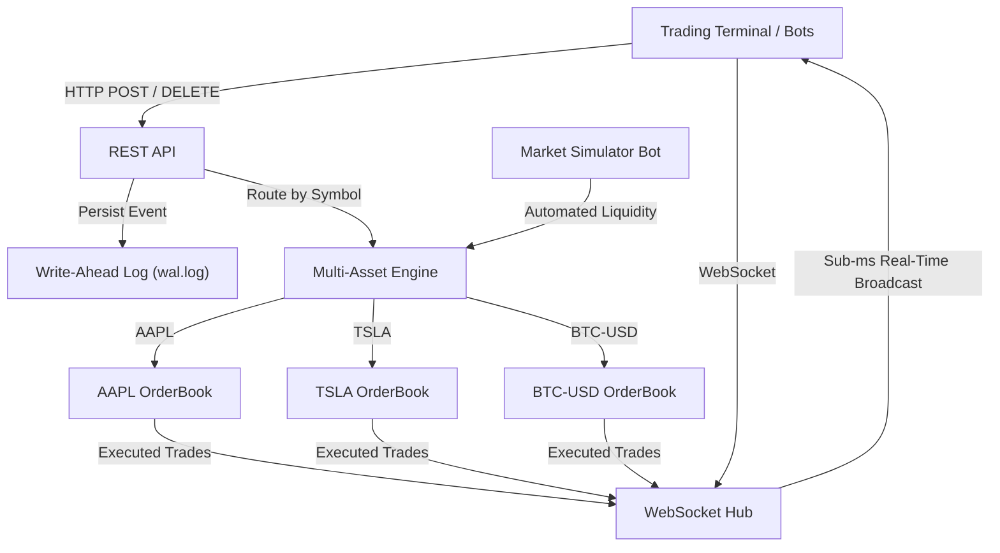

# High-Performance Order Matching Engine (OME) & Trading Terminal

[](https://github.com/divya-3005/OME/actions/workflows/ci.yml)

A low-latency, multi-asset financial order matching engine and institutional trading terminal built from scratch in Go. Features sub-microsecond Price-Time Priority (FIFO) matching, Limit & Market order execution, Write-Ahead Logging (WAL) for fault-tolerant crash recovery, real-time WebSocket market data streaming, and an interactive dark-mode trading workstation with Japanese Candlestick and Step-Staircase Market Depth charts.

---

## ⚡ Performance & Benchmarks

The benchmark measures the isolated in-memory matching algorithm (`ProcessOrder`) under a single thread on an Apple M3 (8-core ARM64) using Go 1.22+:

| Metric | In-Memory Engine Benchmark | Details |
| :--- | :--- | :--- |
| **Engine-Level Throughput** | **~5.3 Million orders / sec** | In-memory matching loop |
| **Mean Execution Latency** | **188.5 ns / operation** | Sub-microsecond core matching |
| **Memory Allocation** | **154 B / op** | Intrusive DLL avoids separate node allocations |
| **GC Overhead** | **1 allocation / op** | Single heap allocation per order lifecycle |

```bash
goos: darwin
goarch: arm64
pkg: github.com/divya-3005/OME/server/engine
cpu: Apple M3
BenchmarkProcessOrder-8   8112890   188.5 ns/op   154 B/op   1 allocs/op
PASS
```

> **Note on Benchmark Methodology**: The 188.5 ns/op figure reflects the mean latency of a single `ProcessOrder` execution in memory. It is not an end-to-end figure through the HTTP layer, JSON deserialization, disk WAL fsync, and WebSocket fan-out, where throughput is bounded by network and disk I/O rather than the matching algorithm itself.

---

## 🏗️ Architecture & Key Features



### 1. $O(1)$ Price-Time Priority via Doubly Linked Lists
- Orders at each price level form an intrusive **Doubly Linked List** (FIFO queue).
- **Add to queue**: Appended to tail in **$O(1)$**.
- **Pop match**: Extracted from head in **$O(1)$**.
- **Cancel order**: Unlinked directly in **$O(1)$** without array shifting or linear scans.

### 2. $O(1)$ Order Cancellations via Hash Map
- An internal `Orders map[uint64]*Order` enables instant $O(1)$ lookup for order cancellation by ID (eliminating the $O(P \times L)$ scan found in naive matching engines).

### 3. Limit & Market Orders
- **Limit Orders**: Matches at or better than limit price; remaining volume rests on the book.
- **Market Orders**: Sweeps available liquidity immediately across multiple price levels without resting.

### 4. Durability via Write-Ahead Logging (WAL)
- Every order placement and cancellation is appended to disk (`wal.log`).
- On server startup or after an unexpected termination, the engine automatically replays the WAL to reconstruct the exact in-memory order book state.

### 5. Institutional Trading Terminal (Web UI)
- **Live L2 Order Book**: Real-time Bids (Green) and Asks (Red) with dynamic depth bars.
- **Japanese Candlestick Chart**: Real-time OHLC candles with high/low wicks, volume histogram sub-plot, and interactive crosshair.
- **Step-Staircase Market Depth Chart**: True step curves (`_|-|_`) visualizing cumulative liquidity slopes with hover tooltips.
- **Market Simulator Bot**: Automated background bot injecting realistic liquidity and trades with one-click pause/resume.
- **24h Ticker Stats**: Real-time High, Low, Volume, and Change % tracking.
- **Click-to-Trade**: Clicking any price in the order book immediately populates the order entry ticket.
- **Synthesized Audio Chime**: Subtle audio feedback on executions using the browser's Web Audio API.

### 6. Zero Precision Loss via Fixed-Point Integer Arithmetic
- Eliminates floating-point rounding errors by representing all prices and amounts in integer ticks/cents (`uint64`).

---

## 🎯 Key Engineering Highlights

- **Engineered a high-throughput in-memory Order Matching Engine in Go**, achieving an engine-level throughput of **~5.3M orders/sec** with a mean matching latency of **188.5 ns/op** using Price-Time Priority (FIFO).
- **Architected $O(1)$ order operations** utilizing intrusive Doubly Linked Lists for price-level order queues and an indexed hash map for instant order cancellations.
- **Implemented Limit and Market order execution**, supporting multi-level liquidity sweeps and zero-loss fixed-point integer pricing (`uint64`).
- **Built Write-Ahead Logging (WAL) for durability**, persisting order transitions to disk and enabling deterministic crash recovery on startup.
- **Developed a real-time WebSocket market data feed and institutional trading workstation** featuring an L2 order book, Japanese Candlestick chart, step-staircase liquidity depth chart, and background market maker bot.

---

## 🚀 Getting Started

### 1. Run the Server & Trading Terminal
```bash
cd server
go run .
```
The server starts on `http://localhost:8080`.
Open **[http://localhost:8080](http://localhost:8080)** in your browser to interact with the live trading terminal.

### 2. Run Tests & Benchmarks
```bash
cd server

# Run all unit tests (FIFO, Partial Fills, Market Orders, WAL Recovery)
go test -v ./...

# Run performance benchmarks with memory statistics
go test -bench=. -benchmem -run=^$ ./...
```

---

## 📡 API Reference

### 1. Place an Order
`POST /order`
```bash
# Place a Limit Buy order for 10 AAPL @ $150.00
curl -X POST http://localhost:8080/order \
  -H "Content-Type: application/json" \
  -d '{
    "id": 101,
    "symbol": "AAPL",
    "side": 0,
    "type": 0,
    "price": 15000,
    "amount": 10
  }'

# Place a Market Buy order for 5 AAPL
curl -X POST http://localhost:8080/order \
  -H "Content-Type: application/json" \
  -d '{
    "id": 102,
    "symbol": "AAPL",
    "side": 0,
    "type": 1,
    "amount": 5
  }'
```
*(Notes: `side: 0` = Buy, `side: 1` = Sell. `type: 0` = Limit, `type: 1` = Market. Price is in cents).*

### 2. View Order Book Depth
`GET /orderbook?symbol=AAPL`
```bash
curl "http://localhost:8080/orderbook?symbol=AAPL"
```

### 3. Cancel an Order
`DELETE /order?symbol=AAPL&id=101`
```bash
curl -X DELETE "http://localhost:8080/order?symbol=AAPL&id=101"
```

### 4. Real-Time WebSocket Stream
Connect to `ws://localhost:8080/ws` to receive live JSON events on trades and cancellations.
