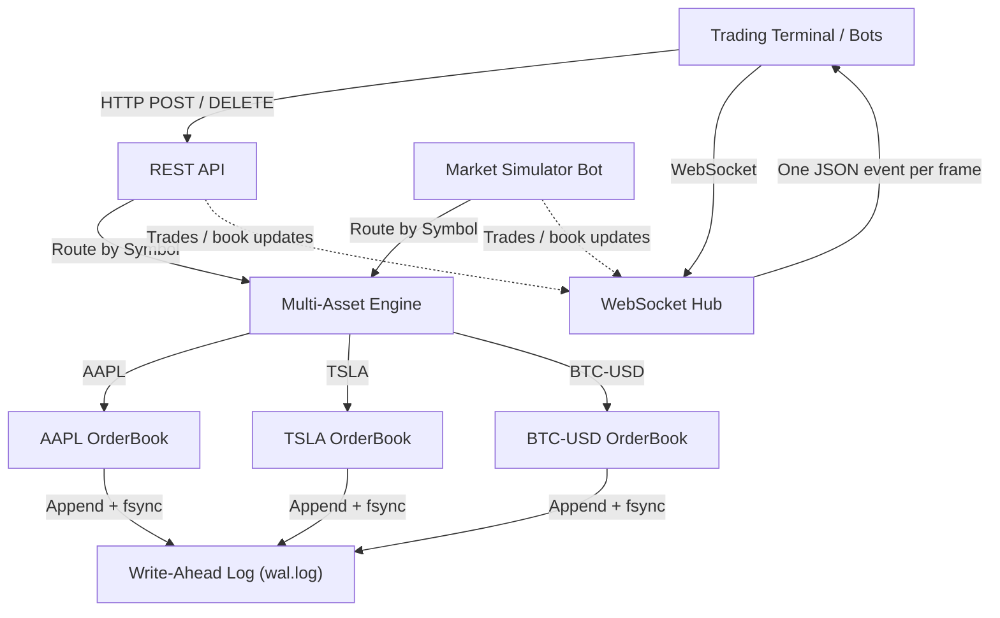

# High-Performance Order Matching Engine (OME) & Trading Terminal

[](https://github.com/divya-3005/OME/actions/workflows/ci.yml)

A low-latency, multi-asset financial order matching engine and institutional trading terminal built from scratch in Go. Features sub-microsecond Price-Time Priority (FIFO) matching, Limit & Market order execution, Write-Ahead Logging (WAL) for fault-tolerant crash recovery, real-time WebSocket market data streaming, and an interactive dark-mode trading workstation with Japanese Candlestick and Step-Staircase Market Depth charts.

---

## ⚡ Performance & Benchmarks

Benchmarked on an Apple M3 (8-core ARM64) using Go 1.22 (see server/go.mod):

| Metric | In-Memory Engine Benchmark | Details |
| :--- | :--- | :--- |
| **Engine-Level Throughput** | **~5.60M iterations/s (~11.20M orders/s)** | Sustained 2-order match + replenish loop |
| **Mean Execution Latency** | **178.5 ns/op (≈ 89.3 ns per order)** | 1 op = 1 matching buy + 1 replenishing sell |
| **Memory Allocation** | **232 B / op** | Intrusive DLL avoids separate node allocations |
| **Allocations** | **4 allocs / op** | one `Order` per submitted order, plus one `Trade` and one trades-slice allocation per match |

```bash
goos: darwin
goarch: arm64
pkg: github.com/divya-3005/OME/server/engine
cpu: Apple M3
BenchmarkProcessOrder-8          	 6058138	       178.5 ns/op	     232 B/op	       4 allocs/op
BenchmarkProcessOrderWithWAL-8   	     250	   5264047 ns/op	     552 B/op	       8 allocs/op
PASS
```

> **Note on Benchmark Methodology**: Each iteration submits a buy that matches one resting ask, then replenishes one unit at the exact traded price, so the book shape is constant and every iteration exercises the matching path. It reflects the mean latency of an active matching cycle (one incoming aggressor order matched against the book + one replenishment limit order) in memory. It is not an end-to-end figure through the HTTP layer, JSON deserialization, disk WAL fsync, and WebSocket fan-out, where throughput is bounded by network and disk I/O rather than the matching algorithm itself. For disk-persisted durability, `BenchmarkProcessOrderWithWAL` measures the synchronous Write-Ahead Log path with atomic `fsync` per transaction. The 552 B/op in `BenchmarkProcessOrderWithWAL` reflects the 232 B in-memory matching lifecycle plus two JSON record marshals (one buy match + one replenishment sell).

---

## 🏗️ Architecture & Key Features



### 1. Sorted Price Levels with $O(\log P)$ Search & $O(1)$ FIFO Queues
- **Price Levels**: Maintained in sorted order (bids descending, asks ascending) using binary search lookup ($O(\log P)$) with slice insertion shift ($O(P)$).
- **Intrusive Doubly Linked Lists**: Orders at each price level form an intrusive FIFO queue:
  - **Add to queue**: Appended to tail in **$O(1)$** once the price level exists.
  - **Pop match**: Extracted from head in **$O(1)$**.
  - **Cancel order**: O(log P) binary search to find the price level, then O(1) unlink; if the level empties, an extra O(P) slice shift.
- **Garbage-Collector Safe**: Pointer references are explicitly zeroed during level eviction, preventing backing-array memory retention.

### 2. $O(1)$ Order Lookup by ID & Unified ID Namespace
- **Instant Cancellations**: An internal `Orders map[uint64]*Order` enables instant O(1) order lookup by ID (eliminating the $O(P \times L)$ scan found in naive matching engines).
- **Unified ID Namespace & Reconciliation**: Order IDs are always assigned sequentially by the server (`eng.NextOrderID()`), and requests that include an `id` are rejected with 400. After WAL recovery the generator is advanced to the highest recovered ID (`SetMinOrderID`), ensuring subsequent order IDs monotonically increase above all recovered and previously assigned IDs without collisions.

### 3. Fine-Grained Concurrency & Non-Blocking Hub
- **Per-Symbol Synchronization**: Each `OrderBook` is protected by its own `sync.RWMutex`. This eliminates cross-symbol lock contention, allowing concurrent matching across distinct asset pairs (`AAPL`, `TSLA`, `BTC-USD`).
- **TOCTOU-Free Order Ingestion**: Validation, WAL append + `fsync`, and matching run inside the per-book lock. If the WAL append fails, the order is rejected with 503 and nothing is applied to the book. Trade and book events are published inside the same lock, so they reach clients in execution order.
- **Non-Blocking WebSocket Hub**: Implements dedicated per-client buffered channels (`send chan []byte`), write deadlines, origin verification (safeguarding against cross-site hijacking), and background `writePump` routines. A slow or wedged client cannot stall the broadcast event loop or block other traders.

### 4. Limit & Market Orders with Explicit Execution Status
- **Limit Orders**: Matches at or better than limit price; remaining volume rests on the book.
- **Market Orders**: Sweeps available liquidity immediately across multiple price levels without resting.
- **Transparent Execution Feedback**: API responses explicitly return `requested_amount`, `filled_amount`, `remaining_amount`, and execution status (`FILLED`, `RESTING` (limit), `PARTIALLY_FILLED_RESTING` (limit), `PARTIALLY_FILLED` (market), `UNFILLED` (market)). `order.amount` in the response is the submitted amount; use `remaining_amount` for what is left.

### 5. Durability via Write-Ahead Logging (WAL) & fsync
- **Admission-Gated Logging**: Only pre-validated, admissible orders are logged to disk (`wal.log`), adhering to strict WAL discipline (unregistered symbols or duplicate payloads are rejected before dirtying the log).
- **Durable append**: each placement/cancellation is written and `fsync`ed under one lock before the HTTP response. On a failed write the file is rolled back to its previous length; on a failed `fsync` the log is rolled back and disabled (all further orders get 503) until restart. (Note: directory entry synchronization on initial file creation is filesystem-dependent).
- **Recovery**: replays every record. An incomplete or corrupt *final* record, which was never acknowledged, is dropped. Corruption *followed by more records* aborts startup instead of truncating acknowledged data. Replay into engine order books is executed outside the WAL lock to maintain strict lock hierarchy.

### 6. Institutional Trading Terminal (Web UI)
- **Live L2 Order Book**: Real-time Bids (Green) and Asks (Red) with dynamic depth bars, click-to-trade, and top-15 level display.
- **Japanese Candlestick Chart**: Real-time OHLC candles with high/low wicks, live price line, glowing axis badge, volume histogram sub-plot, and interactive crosshair, built only from live trades, bucketed into 15-second intervals by trade timestamp.
- **Step-Staircase Market Depth Chart**: True step curves (`_|-|_`) visualizing cumulative liquidity slopes with hover tooltips.
- **Market Simulator Bot**: Automated background bot injecting realistic liquidity and trades with one-click pause/resume.
- **Session Ticker Stats**: high, low, volume and change computed from trades received since the page loaded.
- **Click-to-Trade**: Clicking any price in the order book immediately populates the order entry ticket.
- **Synthesized Audio Chime**: Subtle audio feedback on executions using the browser's Web Audio API.

### 7. Zero Precision Loss via Fixed-Point Integer Arithmetic
- Eliminates floating-point rounding errors by representing all prices and amounts in integer ticks/cents (`uint64`).

---

## 🎯 Key Engineering Highlights

- **Engineered a high-throughput in-memory Order Matching Engine in Go**, achieving an engine-level throughput of **~11.20M orders/sec** with a mean matching latency of **178.5 ns/op (1 op = 1 matching buy + 1 replenishing sell, ≈ 89.3 ns per order)** using Price-Time Priority (FIFO).
- **Architected O(1) queue operations within a price level and O(log P) price-level lookup** utilizing intrusive Doubly Linked Lists for price-level order queues, binary search ($O(\log P)$) for sorted price levels, and an indexed hash map for instant order cancellations.
- **Implemented fine-grained concurrency**, isolating mutex locks per order book to enable parallel matching across asset books and race-free coordination between HTTP endpoints, WebSocket broadcasts, and background simulation bots (verified via Go's `-race` detector).
- **Implemented Limit and Market order execution**, supporting multi-level liquidity sweeps and zero-loss fixed-point integer pricing (`uint64`).
- **Built Write-Ahead Logging (WAL) for durability**, persisting order transitions to disk and enabling deterministic crash recovery on startup.
- **Developed a real-time WebSocket market data feed and institutional trading workstation** featuring an L2 order book, Japanese Candlestick chart with live price badge, step-staircase liquidity depth chart, and background market maker bot.

---

## 🚀 Getting Started

### Prerequisites
- **Go 1.22 or later** is required (the HTTP router uses method-based patterns introduced in Go 1.22).

### 1. Run the Server & Trading Terminal
```bash
cd server
go run .
```
The server starts on `http://localhost:8080`.
Open **[http://localhost:8080](http://localhost:8080)** in your browser to interact with the live trading terminal.

### 2. Run Tests & Benchmarks
```bash
cd server

# Run all unit tests (FIFO, Partial Fills, Market Orders, WAL Recovery)
go test -v ./...

# Run performance benchmarks with memory statistics
go test -bench=. -benchmem -run=^$ ./...
```

---

## 📡 API Reference

> **Security & Content Negotiation**: `POST /order` requires `Content-Type: application/json` (returns 415 otherwise). State-changing requests from untrusted browser origins get 403.

### Status & Error Codes

| Status Code | Reason |
| :--- | :--- |
| `400 Bad Request` | Invalid order payload, missing required query params on DELETE (`symbol`, `id`), client-supplied `id` in POST body, or payload > 1MB |
| `403 Forbidden` | Origin header not allowed (state-changing browser requests) |
| `404 Not Found` | Unknown symbol, or order ID not found for cancellation (`DELETE /order`) |
| `409 Conflict` | Duplicate order ID (internal engine safeguard) |
| `415 Unsupported Media Type` | Content-Type is not `application/json` on `POST /order` |
| `503 Service Unavailable` | Write-Ahead Log (WAL) failure / append rejected |

### 1. Place an Order
`POST /order`
```bash
# Place a Limit Buy order for 10 AAPL @ $150.00
curl -X POST http://localhost:8080/order \
  -H "Content-Type: application/json" \
  -d '{
    "symbol": "AAPL",
    "side": 0,
    "type": 0,
    "price": 15000,
    "amount": 10
  }'

# Place a Market Buy order for 5 AAPL
curl -X POST http://localhost:8080/order \
  -H "Content-Type: application/json" \
  -d '{
    "symbol": "AAPL",
    "side": 0,
    "type": 1,
    "amount": 5
  }'
```
*(Notes: `side: 0` = Buy, `side: 1` = Sell. `type: 0` = Limit, `type: 1` = Market. Price is in cents. Order IDs are assigned server-side; supplying `id` in the POST body returns 400).*

### 2. View Order Book Depth
`GET /orderbook?symbol=AAPL`
```bash
curl "http://localhost:8080/orderbook?symbol=AAPL"
```

### 3. Cancel an Order
`DELETE /order?symbol=AAPL&id=1`
```bash
curl -X DELETE "http://localhost:8080/order?symbol=AAPL&id=1"
```

### 4. View Recent Trades
`GET /trades?symbol=AAPL&limit=50`
```bash
curl "http://localhost:8080/trades?symbol=AAPL&limit=50"
```

### 5. View Open Resting Orders
`GET /orders?symbol=AAPL`
```bash
curl "http://localhost:8080/orders?symbol=AAPL"
```

### 6. Real-Time WebSocket Stream
Connect to `ws://localhost:8080/ws`. Receives one JSON object per frame: `trades` (`data` = array of trades), `book_update` (liquidity or depth changed; refetch `/orderbook`), and `order_cancelled`.

### 7. Toggle Market Simulator Bot
`POST /simulator/toggle`
```bash
curl -X POST http://localhost:8080/simulator/toggle
```
Toggles the automated background market simulation bot on or off. Returns `{"running": true}` or `{"running": false}`.

### 8. Get Market Simulator Status
`GET /simulator/status`
```bash
curl "http://localhost:8080/simulator/status"
```
Returns `{"running": true}` if the background market simulator is active, or `{"running": false}` if paused.

